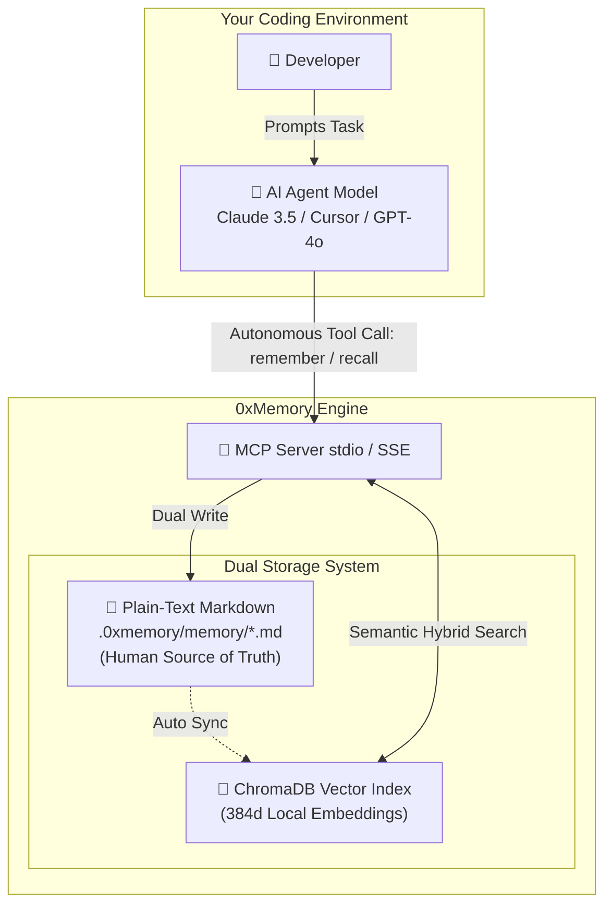

<div align="center">

# 🧠 0xMemory

### Autonomous Agentic Memory Layer for AI Coding Assistants

**Local-First • Git-Native • Human-Editable • MCP Enabled**

[](https://pypi.org/project/oxmemory/)
[](https://opensource.org/licenses/MIT)
[](https://modelcontextprotocol.io)
[](https://github.com/MANOJ-80/0xMemory)

**Stop explaining your codebase architecture to every new chat session.**  
0xMemory provides a persistent, self-evolving cognitive layer for AI agents (Claude, Cursor, Windsurf), **running 100% locally on your machine.**

[Quick Start](#-quick-start) • [How It Works](#-how-it-works) • [Agentic Features](#-agentic-features) • [Installation](#-installation)
</div>

---

## 🔒 Local AI First-Class Support

**Your proprietary code is yours. 0xMemory is engineered from the ground up for privacy-conscious developers.**

*   **100% Local Embeddings**: Built-in `sentence-transformers` (`all-MiniLM-L6-v2`) and embedded `ChromaDB` vector engine. Zero cloud dependencies.
*   **Ollama & LM Studio Native**: Works seamlessly with local LLM providers (`http://localhost:11434` / `http://localhost:1234`).
*   **Offline Mode**: Operates completely off-grid without requiring third-party API keys.

Check your local connection instantly:
```bash
0xmemory check-local
```

---

## 🚀 Why 0xMemory?

Modern AI coding agents possess deep reasoning skills but suffer from **session amnesia**—they forget architectural choices, design trade-offs, and past bug fixes the moment a session ends.

**0xMemory gives AI agents an autonomous cognitive loop.**

| Feature | ☁️ Cloud Memory APIs | ⌨️ Basic CLI Tools | 🧠 0xMemory |
| :--- | :--- | :--- | :--- |
| **Primary Goal** | Application Storage | Chat Interaction | **Autonomous Agentic Memory** |
| **Data Privacy** | ❌ Third-party Cloud | ⚠️ Session-only | ✅ **100% Local & Private** |
| **Storage Engine** | ❌ Opaque Vector DB | ❌ Temporary Files | ✅ **Markdown + ChromaDB Vector** |
| **Human Auditability** | ❌ Read-Only API | ❌ Re-prompting | ✅ **Edit Markdown Directly** |
| **Scope** | 🌍 Global User | ⏱️ Temporary Session | 📂 **Git-Native Per Repository** |
| **Cost** | ❌ Monthly SaaS | ✅ Free | ✅ **100% Free & Open Source** |

---

## 🧩 How It Works: Autonomous Agentic Loop

0xMemory operates via the open **Model Context Protocol (MCP)** standard. The AI Agent Model uses its internal reasoning to autonomously decide when to store decisions and when to recall past context.



### The 3 Autonomous Memory Streams

1. **In-Session Agentic Tool Calling (`remember` / `recall`)**  
   During conversation, the AI Agent model autonomously evaluates key architectural choices (*"We chose PostgreSQL for ACID compliance"*) and issues an MCP tool call to save it. When context is missing, the model autonomously calls `recall` to search past memories.

2. **Passive Background Memory Harvesting (`0xmemory observe`)**  
   An automated Git post-commit background loop analyzes your code diffs, harvesting architectural decisions and completed features into memory without human effort.

3. **Human Inspection & Direct Editing**  
   Memories are saved as human-readable Markdown files (`facts.md`, `decisions.md`). You can open them in VS Code, edit, or delete lines anytime. Running `0xmemory rebuild` instantly syncs ChromaDB.

---

## ✨ Agentic Features

- [x] **Autonomous Memory Decisions**: AI agent models independently determine what information is worth remembering and when to search.
- [x] **Project-Scoped Brains**: One brain per repository (`.0xmemory/`). Context never leaks between projects.
- [x] **Cross-Agent Compatibility**: Seamlessly works across **Cursor**, **Claude Desktop**, **Windsurf**, **VS Code (Cline/Roo)**, and **Custom Python Agents**.
- [x] **Dual Persistence Engine**:
  - **Human-Readable**: Durable Markdown files (`facts.md`, `decisions.md`) for Git version control.
  - **Machine-Readable**: In-process `ChromaDB` vector DB for fast semantic search.
- [x] **Passive Git Harvesting**: Background observer reads commit diffs to record completed features automatically.
- [x] **Context Window Protection**: Top-$N$ candidate search limits (`limit=5`) prevent prompt bloat.

---

## ⚡ Quick Start

### 1. Installation

```bash
pip install oxmemory
```

### 2. Initialize Brain in Repository

Navigate to your project root and initialize 0xMemory:

```bash
cd my-project
0xmemory init
```

*This creates a `.0xmemory/` directory containing `brain.md` and `memory/` storage files.*

### 3. Connect to Your AI Agent

#### For Cursor / Windsurf

Add 0xMemory to your MCP server configuration:

```json
{
  "mcpServers": {
    "0xMemory": {
      "command": "0xmemory",
      "args": ["serve"]
    }
  }
}
```

#### For Claude Desktop

Add to `claude_desktop_config.json`:

```json
{
  "mcpServers": {
    "0xmemory": {
      "command": "0xmemory",
      "args": ["serve"]
    }
  }
}
```

---

## 🛠️ Execution Patterns

### 1. Interactive Agentic Flow
Simply chat with your AI agent as usual. When you make architectural decisions or complete features, the AI Agent model autonomously invokes `remember` to persist the state.

### 2. Passive Background Observer Flow
Enable the Git hook to let 0xMemory passively monitor code changes:
```bash
0xmemory observe
```

---

## 📂 Repository Brain Structure

Your repository brain is 100% transparent and Git-native inside `.0xmemory/`:

| File / Path | Purpose |
| :--- | :--- |
| `brain.md` | **Main Overview**. High-level architecture, conventions, and project goals. |
| `memory/facts.md` | Technical constraints, environment setup, and configurations. |
| `memory/decisions.md` | Architectural decision logs and trade-off rationales. |
| `memory/learnings.md` | Gotchas, lessons learned, and bug resolution patterns. |
| `memory/preferences.md` | User coding preferences and style guidelines. |
| `.store/` | *(Git-ignored)* Local ChromaDB vector database index. |

---

## 🤝 Contributing

We are building the open standard for local, autonomous AI agent memory.

- **Bugs & Issues?** Open an issue on GitHub.
- **Pull Requests?** PRs are warmly welcome!

<div align="center">
  <sub>Built for developers who want their AI agents to actually remember decisions.</sub>
</div>
