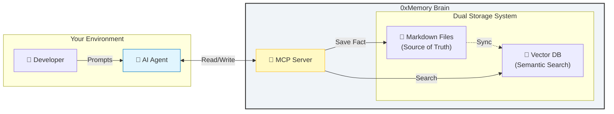

<div align="center">

# 0xMemory

### The Missing Memory Layer for AI Agents

**Market Trend 2026:** People want **PRIVATE AI systems**. 0xMemory delivers.

[](https://pypi.org/project/oxmemory/)
[](https://opensource.org/licenses/MIT)
[](https://modelcontextprotocol.io)
[](https://github.com/MANOJ-80/0xMemory)

**Stop explaining your project to every new chat session.**  
0xMemory transforms your repository into a self-documenting brain that evolves with your code, **running entirely locally on your machine.**

[Quick Start](#-quick-start) • [How It Works](#-how-it-works) • [Local AI First](#-local-ai-first) • [Features](#-features) • [Installation](#-installation)
</div>

---


## 🔒 Local AI First-Class Support

**Your data is yours. 0xMemory is engineered from the ground up for the privacy-conscious developer.**

*   **Ollama Native**: Works out-of-the-box with `llama3`, `mistral`, or any Ollama model.
*   **LM Studio Support**: Seamlessly connect to your local LM Studio server (`http://localhost:1234`).
*   **Local Embeddings**: Ships with `ChromaDB` and `sentence-transformers` for 100% offline, local semantic search. Zero cloud dependencies.
*   **Offline Mode**: Go completely off-grid. `0xmemory init --local` configures everything to use your local machine's resources without ever prompting for an API key.

Check your local AI connection instantly:
```bash
0xmemory check-local
```


## 🚀 Why 0xMemory?

Building complex software with AI agents is frustrating because they **forget**. They forget your architecture decisions, your coding conventions, and what you fixed yesterday.

**0xMemory bridges the gap between simple CLI tools and complex cloud memory APIs.**

| Feature          | ☁️ Cloud Memory APIs   | ⌨️ CLI Agents    | 🧠 0xMemory                |
| :--------------- | :--------------------- | :--------------- | :------------------------- |
| **Primary Goal** | App Integration        | Chat Interaction | **Project Intelligence**   |
| **Data Privacy** | ❌ Third-party Servers | ⚠️ Session-only  | ✅ **100% Local**          |
| **Storage**      | ❌ Hidden Vector DB    | ❌ Temp Files    | ✅ **Markdown + Vector**   |
| **Control**      | ❌ API Access Only     | ❌ Re-prompting  | ✅ **Edit Files Directly** |
| **Scope**        | 🌍 Global / User       | ⏱️ Session       | 📂 **Per-Repository**      |
| **Cost**         | ❌ Subscription        | ✅ Free          | ✅ **Free (Open Source)**  |

Most tools define memory as "storing chat logs". 0xMemory defines it as **curating project knowledge**.

---

## 🧩 How It Works

0xMemory isn't just a file writer. It's a **living knowledge loop** that runs legally on your machine.



### The Knowledge Pipeline

1.  **Capture (The Ear)**

    - **Manual**: You explicitly tell it: _"Remember that we use Poetry for deps."_
    - **Auto-Extraction**: You dump a raw chat log, and 0xMemory uses a local LLM (or API) to distill it into atomic facts: _"Fact: Project uses Poetry. Decision: Switched from pipenv on 2024-01-15."_

2.  **Storage (The Hippocampus)**

    - **Source of Truth**: Everything is saved to `.0xmemory/memory/*.md`. These are standard Markdown files. You can edit, delete, or version control them with Git.
    - **Indexing**: Every save triggers a background sync to a local **ChromaDB** vector store. This turns text into mathematical embeddings for **semantic** search.

3.  **Recall (The Voice)**
    - **Hybrid Search**: Use Vector Search (conceptual matches) + Keyword Search (exact matches).
    - **Context Injection**: When you ask _"How do I install dependencies?"_, 0xMemory finds the relevant facts and injects them into your AI's context window _before_ it answers.

---

## ✨ Features

### ✅ Implemented

- [x] **Project-Scoped Brains**: One brain per repository. Context never leaks.
- [x] **Cross-LLM Compatible**: Works with **Cursor**, **Claude Desktop**, **Windsurf**, and **Gemini CLI**.
- [x] **Hybrid Search**: Combines keyword matching with semantic vector search for 100% recall.
- [x] **Human-Editable**: Your memory is just `brain.md` and `facts.md`. Edit them like code.
- [x] **Knowledge Extraction**: `0xmemory extract` turns messy chat logs into structured facts.
- [x] **Dual Storage**:
  - **Read**: Fast semantic search via ChromaDB.
  - **Write**: Durable Markdown files for version control.

### 🚧 Roadmap

- [ ] **Git Automation**: Auto-commit memory changes (`feat: learned 3 new facts`).
- [ ] **Memory Decay**: Old, unused memories fade away to keep context fresh.
- [ ] **Reinforce Tool**: Manually strengthen important memories.
- [ ] **Context Window Control**: Smartly truncate context to fit token limits.
- [ ] **Session Summary**: Auto-summarize chat logs into concise insights.

---

## ⚡ Quick Start

### 1. Set Up Environment

```bash
python3 -m venv .venv
source .venv/bin/activate  # On Windows: .venv\Scripts\activate
```

### 2. Install

```bash
pip install oxmemory
```

### 3. Initialize

Go to your project root and create a brain:

```bash
cd my-project
0xmemory init
```

\*This creates a `.0xmemory/` directory. **Add `.0xmemory/brain.md` to your editor and describe your project high-level goals.\***

### 4. Serve

Start the memory server:

```bash
0xmemory serve --transport http
```

### 5. Connect

#### For Cursor / Windsurf

Add this to your MCP config:

```json
{
  "mcpServers": {
    "0xMemory": {
      "url": "http://localhost:8000/sse",
      "transport": "sse"
    }
  }
}
```

#### For Claude Desktop

Add to `claude_desktop_config.json`:

```json
{
  "mcpServers": {
    "0xmemory": {
      "command": "0xmemory",
      "args": ["serve"],
      "cwd": "/absolute/path/to/your/project"
    }
  }
}
```

---

## 🛠️ Usage Patterns

### The "Disciplined" Flow (Manual)

_Best for keeping a clean, high-quality brain._

1. **Teach**: "Remember that we use `black` for formatting."
2. **Verify**: "What are our formatting rules?"
3. **Correct**: Open `.0xmemory/memory/facts.md` and edit the text directly if the AI got it wrong.

### The "Lazy" Flow (Automated)

_Best for fast-moving development sessions._

1. **Dump**: Provide a messy brain dump or paste a conversation logs.
2. **Extract**: Run `0xmemory extract "..."`
3. **Review**: 0xMemory uses an LLM (Groq/Ollama) to parse out the facts for you.

---

## 📂 Project Structure

Your brain is transparent. Here's what's inside `.0xmemory/`:

| File                  | Purpose                                                         |
| :-------------------- | :-------------------------------------------------------------- |
| `brain.md`            | **The Core**. High-level architecture, goals, and user context. |
| `memory/facts.md`     | Technical facts (e.g., "API runs on port 8000").                |
| `memory/decisions.md` | Decision logs (e.g., "Why we chose HTMX over React").           |
| `sessions/`           | Archived chat logs for historical retrieval.                    |
| `.store/`             | (Git-ignored) Local ChromaDB vector index.                      |

---

## 🏗️ Advanced: Token Optimization

As your memory grows, you can optimize how Cursor uses it.

### Default Mode (Direct Access)

Cursor reads `.0xmemory/*.md` files directly into its context window.

- ✅ Fast - no tool calls needed
- ❌ Uses tokens - can fill context with large memories

### Token Saver Mode

Force Cursor to use the `recall` tool (vector search) instead of reading files directly. This scales to unlimited memories with zero token cost until needed.

**Step 1**: Create `.cursorignore` in your project root:

```text
.0xmemory/memory/*.md
```

**Step 2**: Copy the rules template to your project:

```bash
cp examples/cursorrules.template .cursorrules
```

Or create a minimal `.cursorrules`:

```markdown
# 0xMemory Rules

You have a long-term memory system called 0xMemory.
When you need project context or past decisions, use the `recall` tool to search for it.
ALWAYS check `recall` before saying "I don't know".
```

## 📝 AI Context Templates

We provide ready-to-use context files for different AI agents. Copy these to your project root:

| File                            | For                 | Usage                  |
| :------------------------------ | :------------------ | :--------------------- |
| `examples/cursorrules.template` | Cursor IDE          | Copy as `.cursorrules` |
| `examples/CLAUDE.md`            | Claude Code/Desktop | Copy as `CLAUDE.md`    |
| `examples/GEMINI.md`            | Gemini CLI          | Copy as `GEMINI.md`    |
| `examples/AGENT.md`             | Any AI agent        | Universal template     |

Each template includes:

- Full tools and resources reference
- Behavior guidelines
- Customization section for your project context

---

## 🤝 Contributing

We are building the standard for local AI memory.

- **Bugs?** Open an issue.
- **Ideas?** Discussions are open.
- **Code?** PRs welcome!

<div align="center">
  <sub>Built for developers who want their AI to actually remember things.</sub>
</div>
