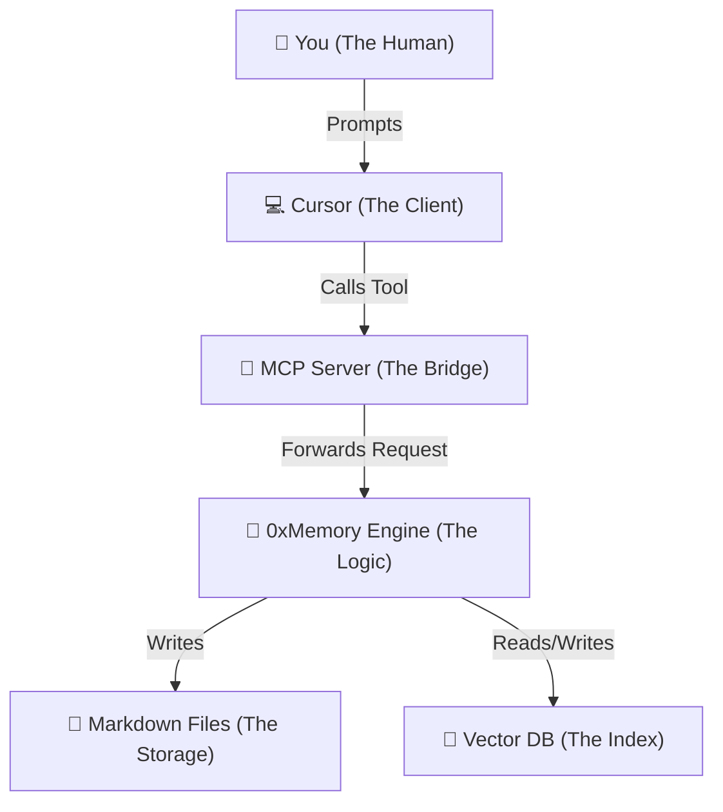

# 🧠 How 0xMemory Works: The Deep Dive

> **Objective:** To demystify the "Magic" and explain exactly what happens when you type a command.

0xMemory is not just a simple script; it is a **Distributed System** running on your local machine.

It consists of three distinct layers:

1.  **The Client Layer** (Cursor/Claude)
2.  **The Bridge Layer** (MCP Server)
3.  **The Brain Layer** (Storage & Logic)

---

## 1. The Architecture Diagram



---

## 2. The Three Layers

### Layer 1: The Client (Cursor)

Cursor doesn't know _how_ to save memories. It only knows that a "Tool" exists called `remember`.

- **Role**: The Interface.
- **What it does**: It chats with you. When it realizes "I need to save this", it sends a request to the server.
- **Analogy**: Cursor is the customer ordering execution.

### Layer 2: The Bridge (MCP Server)

This is the process you run with `0xmemory serve`.

- **Role**: The Translator.
- **Protocol**: It speaks **MCP (Model Context Protocol)**. This is a standard language (JSON-RPC) that Anthropic and Cursor understand.
- **Transport**: We use **SSE (Server-Sent Events)** over HTTP.
  - Cursor sends a `POST` request (Action).
  - Our Server sends events back (Results).

### Layer 3: The Brain (MemoryStore)

This is the Python code we wrote (`src/oxmemory/storage`).

- **Role**: The Worker.
- **Components**:
  - **Markdown Manager**: Reads/Writes the `.md` files.
  - **Vector Store**: Converts text into numbers (Embeddings) so we can search by "meaning", not just keywords.
  - **Session Manager**: Tracks history.

---

## 3. The Lifecycle: A Day in the Life of a Memory

Let's trace exactly what happens when you say:

> **"Remember that we use Poetry."**

### Step 1: Triggering (The Client)

1.  Cursor reads your message.
2.  It looks at its tool definition: `remember(thing_to_remember: str)`.
3.  It decides: "Aha! I should call this tool."
4.  It sends a JSON HTTP POST to `localhost:8000/messages`:
    ```json
    {
      "method": "tools/call",
      "params": {
        "name": "remember",
        "arguments": { "thing_to_remember": "We use Poetry." }
      }
    }
    ```

### Step 2: Routing (The MCP Server)

1.  FastAPI (`http_server.py`) receives the POST request.
2.  It hands the raw JSON to the `mcp` SDK (`server.py`).
3.  The SDK looks up the function registered for `remember`.
4.  It calls our Python function `handle_remember()`.

### Step 3: Processing (The Logic)

1.  **Classification**: The code checks "Is this a Fact, Decision, or Preference?".
    - It sees "We use..." -> Likely a **Fact**.
2.  **Storage**:
    - It opens `.0xmemory/memory/facts.md`.
    - It appends the new line: `- We use Poetry.`
3.  **Indexing (The "Magic")**:
    - It sends the text "We use Poetry" to `sentence-transformers` (Local AI Model).
    - The model turns it into a list of 384 numbers (Embedding): `[0.12, -0.98, 0.33, ...]`.
    - This list is saved into `ChromaDB` (in `.0xmemory/.store`).

### Step 4: Response

1.  The function returns "Memory saved successfully."
2.  The MCP Server wraps this in JSON.
3.  Cursor receives it and shows you the checkmark ✅.

---

## 4. The Retrieval: "How does it Recall?"

When you ask:

> **"How do we manage dependencies?"**

1.  **Search**: Cursor calls the `recall` tool.
2.  **Vector Magic**:
    - Our engine converts "How do we manage dependencies?" into numbers `[0.11, -0.99, ...]`
    - It asks ChromaDB: "Who is mathematically closest to these numbers?"
    - ChromaDB finds the "We use Poetry" vector (because "Poetry" and "dependencies" are semantically close).
3.  **Result**: It returns the text "We use Poetry" to Cursor.
4.  **Answer**: Cursor reads that and answers you: "We use Poetry."

---

## 5. Why did we build it this way?

- **Local-First**: We used Markdown so _you_ can edit it. If we locked it in a database, you couldn't fix typos easily.
- **MCP Standard**: By using MCP, we didn't have to write a custom plugin for Cursor. We just wrote a server, and Cursor (and Claude) connected to it automatically.
- **Hybrid Search**: We use Markdown (for human readability) AND Vectors (for AI searchability). This gives us the best of both worlds.

---

## 🧠 Summary

- **You** trigger the action.
- **Cursor** sends the JSON.
- **MCP Server** translates JSON to Python.
- **Python** writes the file and calculates the math (vectors).
- **ChromaDB** remembers the math.
- **Markdown** remembers the text.
